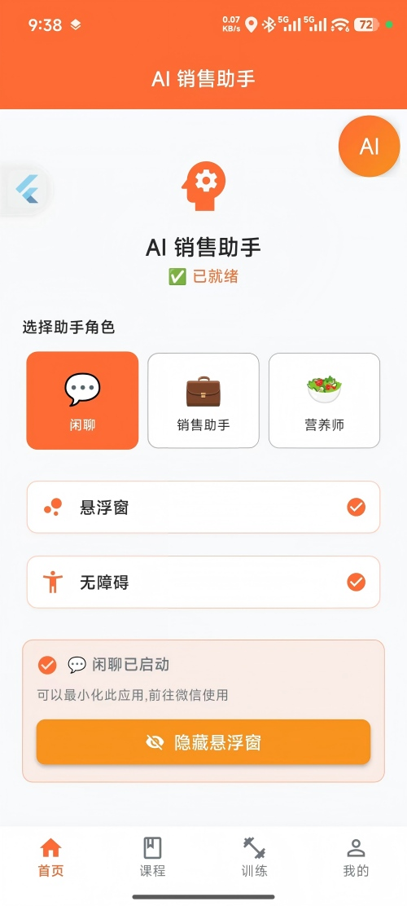
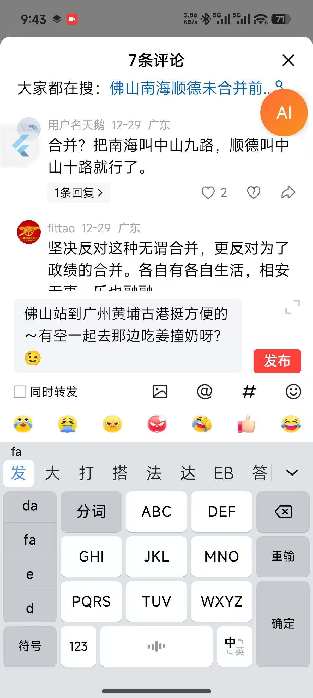

# AI 销售助手 (AI Sales Assistant)

> 一个基于 Flutter 开发的智能对话辅助工具，帮你优雅地回复每一条消息 💬

## 📖 项目简介

这是一个**纯前端**的 AI 对话辅助应用（无需担心隐私安全问题 😅），通过悬浮窗和 AI 技术，让你在任何聊天场景下都能得心应手。

### 🎯 核心亮点

**悬浮窗智能助手**：轻点悬浮窗，AI 自动读取屏幕内容，为你生成合适的回复建议

**微信环境完美支持** ✨：在微信中使用时，可**完美绕过安全检测**，实现全自动回复流程：
- 📱 AI 生成回复后自动粘贴到输入框
- ✏️ 你可以预览并修改内容
- 📤 确认无误后再发送

**其他 APP 智能适配**：在非微信环境下，AI 回复会自动复制到剪贴板，手动粘贴即可

### 💡 使用场景

- 💑 **恋爱助手**：面对敏感话题不再尴尬，AI 帮你找到最合适的回复方式
- 💼 **销售利器**：快速响应客户，提供专业且贴心的沟通话术
- 🎓 **社交辅助**：提升社交能力，让每次对话都更加得体
- 📝 **商务沟通**：处理工作消息更高效，保持专业形象

### 🚧 开发状态

本项目目前为**半成品状态**，核心功能已可用。

**规划中的功能**（时间允许的话）：
- 📚 **知识库训练**：支持导入公司话术、产品资料等自定义知识
- 🎭 **语气模拟**：学习你的表达风格，生成更符合个人特色的回复
- 🔄 **多场景模板**：预设不同场景的对话模板

### ⚠️ 平台说明

由于使用了大量 Kotlin 原生代码实现核心功能，**目前仅支持 Android 平台**，iOS 暂不支持。

---

## 📸 应用截图

### 主界面


### 微信自动回复演示：点击悬浮窗后，就不用动，会自动把内容粘贴进输入框


### 其他app，需要自己手动粘贴


---

## ✨ 核心功能

- 🪟 **智能悬浮窗** - 一键唤起，随时随地辅助回复
- 🤖 **AI 对话生成** - 基于上下文智能生成合适的回复内容
- 📸 **屏幕内容识别** - OCR 技术快速提取屏幕文字信息
- ⌨️ **自动输入（微信）** - 微信环境下自动填充回复内容
- 📋 **智能剪贴板** - 其他应用自动复制到剪贴板
- 💾 **本地配置** - 所有数据本地存储，保护隐私安全
- 🎨 **简洁界面** - 清爽的 Material Design 设计风格

## 🛠️ 技术栈

- **框架**: Flutter 3.9.2+
- **语言**: Dart
- **状态管理**: Provider
- **网络请求**: HTTP
- **本地存储**: SharedPreferences
- **OCR 引擎**: Google ML Kit Text Recognition
- **权限管理**: Permission Handler

## 📦 依赖库

```yaml
dependencies:
  cupertino_icons: ^1.0.8
  http: ^1.2.0
  shared_preferences: ^2.2.2
  provider: ^6.1.1
  permission_handler: ^11.0.1
  google_mlkit_text_recognition: ^0.13.0
  path_provider: ^2.1.1
```

## 🚀 快速开始

### 环境要求

- Flutter SDK: >=3.9.2
- Dart SDK: >=3.9.2
- Android Studio / VS Code
- Android 手机或模拟器（需要 Android 7.0+）

### 安装步骤

1. **克隆项目**
   ```bash
   git clone <repository-url>
   cd ai_assistant-local
   ```

2. **安装依赖**
   ```bash
   flutter pub get
   ```

3. **配置 AI 服务** ⚡ （重要）
   
   打开 `lib/services/ai_service.dart`，填入你的 API Key；也可以在页面中修改你的提示词。
   
   ```dart
   // 默认使用豆包 AI（字节跳动）
   static const String _baseUrl = 'https://ark.cn-beijing.volces.com/api/v3/chat/completions';
   static const String _apiKey = 'YOUR_API_KEY_HERE';  // 👈 在此填入你的 API Key
   static const String _endpointId = 'doubao-seed-1-6-251015';
   ```
   
   > 💡 **获取 API Key**：前往 [火山引擎](https://console.volcengine.com/ark) 注册并获取豆包 AI 的 API Key
   >
   > 🔧 **使用其他 AI**：你也可以修改 `ai_service.dart` 接入 ChatGPT、文心一言等其他 AI 服务

4. **运行项目**
   ```bash
   # 连接设备或启动模拟器后运行
   flutter run
   ```

5. **构建应用**
   ```bash
   # Android
   flutter build apk --release
   
   # iOS
   flutter build ios --release
   ```

## 📁 项目结构

```
lib/
├── main.dart                    # 应用入口
├── pages/                       # 页面模块
│   ├── home/                   # 主页
│   ├── course/                 # 课程
│   ├── training/               # 培训
│   └── profile/                # 个人中心
├── services/                    # 服务层
│   ├── ai_service.dart         # AI 服务
│   ├── auto_input_service.dart # 自动输入服务
│   └── screen_capture_service.dart # 屏幕捕获服务
├── routes/                      # 路由配置
│   └── app_routes.dart
├── theme/                       # 主题样式
│   ├── app_colors.dart
│   └── app_theme.dart
└── widgets/                     # 公共组件
    └── main_navigation.dart     # 底部导航栏
```

## 🔑 权限说明

应用需要以下权限才能正常运行：

- **悬浮窗权限** - 显示悬浮按钮，随时唤起助手（核心功能）
- **无障碍服务权限** - 用于微信环境下的自动输入功能
- **屏幕截图权限** - 捕获屏幕内容进行 OCR 识别
- **存储权限** - 保存配置和临时文件
- **网络权限** - 调用 AI API 生成回复

> ⚠️ **隐私承诺**：所有权限仅用于本地功能实现，不会上传任何个人数据

## 📝 开发指南

### 添加新页面

1. 在 `lib/pages/` 目录下创建新的页面文件
2. 在 `lib/routes/app_routes.dart` 中注册路由
3. 在导航栏中添加入口（如需要）

### 使用 AI 服务

```dart
import 'package:ai_sales_assistant/services/ai_service.dart';

// 调用 AI 服务
final aiService = AIService();
final response = await aiService.getResponse(prompt);
```

### 屏幕捕获功能

```dart
import 'package:ai_sales_assistant/services/screen_capture_service.dart';

// 截取屏幕
final screenCapture = ScreenCaptureService();
final image = await screenCapture.capture();
```

## 🧪 测试

运行单元测试和集成测试：

```bash
flutter test
```

## 📱 支持平台

- ✅ **Android** (推荐 Android 7.0+)
- ❌ **iOS** - 由于使用了 Kotlin 原生代码，暂不支持
- ❌ **Web/Desktop** - 不适用于桌面平台

## 🤝 贡献指南

欢迎提交 Issue 和 Pull Request！

1. Fork 本仓库
2. 创建特性分支 (`git checkout -b feature/AmazingFeature`)
3. 提交更改 (`git commit -m 'Add some AmazingFeature'`)
4. 推送到分支 (`git push origin feature/AmazingFeature`)
5. 提交 Pull Request

## 📄 许可证

本项目采用 MIT 许可证，欢迎学习和交流。

⚠️ **免责声明**：本项目仅供学习和个人使用，使用时请遵守相关平台的服务条款。

## 📮 联系方式

如有问题、建议或想交流技术实现：

- 📧 **邮箱**：famyking@163.com
- 🐛 **Bug 反馈**：提交 Issue
- 💡 **功能建议**：欢迎在 Issue 中讨论

## ⭐ Star History

如果这个项目对你有帮助，欢迎给个 Star ⭐ 支持一下！

---

<div align="center">

**本项目持续更新中 | Made with ❤️ by Flutter**

*最后更新：2025年12月29日*

</div>
